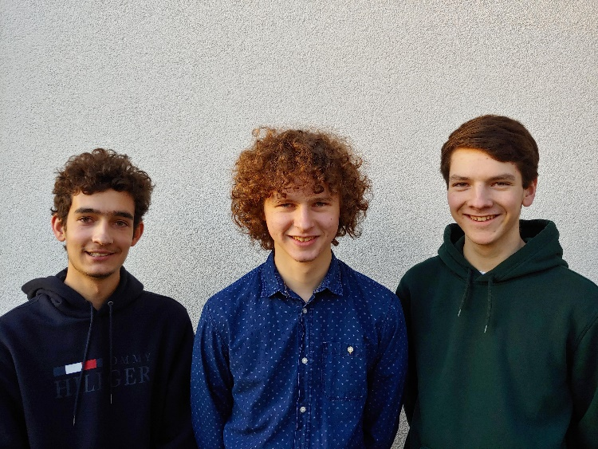

<style>
/* Three image containers (use 25% for four, and 50% for two, etc) */
.column {
  float: left;
  width: 45%;
  padding: 5px;
}

/* Clear floats after image containers */
.row::after {
  content: "";
  clear: both;
  display: table;
}

#unipol {
    border: 2px solid #222;
    border-radius: 8px;
    float: right;
    margin: 5px;
    margin-left: 10px;
}

#unipol-l {
    border: 2px solid #222;
    border-radius: 8px;
    float: left;
    margin: 5px;
    margin-left: 10px;
}
</style>

**Gedankengesteuerte Armprothese**
==================================
> ***Ein Projekt von Frederik Beimgraben, Noah Ihlein und Maximilian Menzel***

**Kurzfassung**
---------------

> <p style="text-align: justify">Das Ziel unserer Arbeit ist, mithilfe eines EEG-Gerätes ein Programm (z.B. eine virtuelle - später reale Armprothese) mit zwei oder mehr Variablen anzusteuern. So könnten billige Prothesen hergestellt werden, welche sehr gut funktionieren, gleichzeitig aber ohne Operationen einsetzbar sind. 
> Unsere Arbeit setzt sich aus dem Bau eines EEG-Gerätes und dem Programmieren von Software, welche die Daten des EEG-Gerätes verarbeiten kann, zusammen. Des Weiteren entstehen eine virtuelle Armprothese und ein Programm, welches diese aus den verarbeiteten Daten des EEG-Gerätes ansteuert.
> Seit Jugend forscht 2019 haben wir ein neues EEG-Gerät gebaut und die Software erweitert und verfeinert. Mithilfe von neuronalen Netzen können die Daten des EEG-Gerätes trotz der hohen Komplexität erkannt werden.</p>

<div class="row">
  <div class="column">
    
  </div>
  <div class="column">
    
  </div>
</div>

<br><br>

***

**Einleitung**
=============

**Ideenfindung**
----------------

<p style="text-align: justify">Zu Beginn des letzten Schuljahres überlegten wir uns ein Projekt, an welchem wir im Schülerforschungszentrum arbeiten wollten. Wir haben uns verschiedene Problembereiche angesehen und wir haben gemerkt, dass wir gerne etwas machen möchten, was sowohl mit Menschen als auch mit Technik zu tun hat. Durch Zufall hat Frederik EEG-Geräte und deren Einsatzbereiche im Internet kennengelernt. Durch Recherche haben wir entdeckt, dass voll funktionsfähige (Arm-) Prothesen bisher nur unter speziellen Bedingungen einsetzbar sind. So müssen beispielsweise bei einem Unfall mit Verlust eines Armes die Nervenenden im Arm intakt bleiben, damit eine Prothese angeschlossen werden kann. Des Weiteren werden große Operationen fällig, um eine spezielle, extra angefertigte Armprothese mit dem Körper und Gehirn zu verbinden. All dies ist natürlich auch mit hohen Kosten verbunden. So haben wir uns dazu entschlossen, eine Armprothese zu bauen, welche mit den Möglichkeiten eines EEG-Gerätes arbeitet. Dadurch sollen alle bestehenden Probleme gelöst werden. In den letzten Monaten ist uns bewusst geworden, dass wir unser System nicht nur auf Armprothesen, sondern auf jede beliebige Art von elektrotechnischen Geräten übertragen können, beispielsweise Drohnen. </p>

***

**Wie möchten wir unser Vorhaben realisieren?**
-----------------------------------------------

<p style="text-align: justify">Die Möglichkeit unser Projekt zu realisieren, bekommen wir durch das Schülerforschungszentrum in Eningen. Wir erhalten dort neben finanzieller Unterstützung auch Beratung von Lehrern. Außerdem werden wir finanziell durch das Mikro-Makro-MINT-Programm in Baden-Württemberg unterstützt. Des Weiteren haben wir Zugriff auf eine Werkstatt, Computer und auch einen 3D-Drucker. Uns stehen verschiedenste Arbeitsmaterialen zur Verfügung. Aufgaben, wie z.B. Programmieren oder Planung betreiben wir aufgrund des hohen Zeitaufwandes nicht nur im SFZ, sondern auch in der Schule, oder Zuhause über Online-Sprachchats. Durch Open-Source Projekte, wie OpenBCI erhalten wir einigermaßen kostengünstigen Zugriff auf EEG-Hardware und haben die Möglichkeit, deren Firmware einfach zu bearbeiten und schnell passende Software zu programmieren. Mithilfe des EEG-Gerätes möchten wir unsere Hirnströme während bestimmter Gedanken messen, um später mit diesen die Prothese anzusteuern. Die Daten des EEG-Gerätes werden von einer eigens programmierten Software geordnet. Mit diesen Daten kann dann ein neuronales Netz trainiert werden, das bereits trainierte und wiederholt auftretende Muster erkennen kann. Die Ergebnisse des neuronalen Netzes können schließlich zur Steuerung der Prothese genutzt werden. Da wir aktuell keinen Zugriff auf eine hochentwickelte bewegliche Armprothese haben, werden wir zunächst eine simulierte Armprothese oder ein Demonstrationsmodell steuern.</p>

<br><br>

***

**Vorgehensweise, Materialien und Methodik**
============================================

**Unsere allgemeine Vorgehensweise**
------------------------------------
<p style="text-align: justify">Zu Beginn unseres Projekts haben wir hauptsächlich jede Woche freitags im Schüler-Forschungs-Zentrum in Eningen gearbeitet. Dort haben wir Zugriff auf eine voll ausgestattete Werkstadt, Computer, 3D-Drucker und Arbeitsmaterialien. Nachteil ist dabei die lange An- und Abfahrtszeit, welche insgesamt über zwei Stunden dauert. Über viele Wochen hinweg hat sich die Arbeit immer weiter nach Hause oder auf freie Zeiten in der Schule verlagert. Vor allem beim Programmieren der Software waren wir nicht auf das SFZ angewiesen, über das Projektmanagement-Tool „Git“ konnten wir alle immer den aktuellen Code auf unsere Computer/Laptops laden. Über das Sprachchat-Programm Discord konnten wir miteinander kommunizieren. Mithilfe von TeamViewer konnten wir auf die Computer des anderen zugreifen und live sehen, was auf dem Bildschirm angezeigt wird. Dies war besonders nützlich, wenn Frederik, Maximilian oder Noah beim Programmieren geholfen hat. Aktuell arbeiten wir circa die Hälfte der Zeit von zu Hause aus. Unser Betreuer im SFZ hat es uns möglich gemacht, einen Schlüssel für das Gebäude zu bekommen, wodurch wir nicht mehr an Freitage gebunden sind und jederzeit das SFZ aufsuchen können. So ist ein Mix aus verschiedenen Arbeitsstandorten entstanden, was vor allem unsere Produktivität stark gefördert hat.</p>

***

**Funktionsweise eines EEG-Gerätes**
------------------------------------

### **Allgemeines**

<image src="2020-01-12_Langfassung_WEB_html_5bb9a16b.png"  width="40%" id="unipol">

<p style="text-align: justify">Das EEG-Gerät (Elektroenzephalographie-Gerät) wurde bereits im Jahr 1929 durch H. Berger entwickelt und wird bis heute beispielsweise bei der Hirntoddiagnostik oder der Diagnose von Epilepsien eingesetzt. Es wird dabei die Spannungsdifferenz zwischen zwei Elektroden gemessen bzw. abgeleitet. Das OpenBCI-System ist auf eine sogenannte Referenzableitung bzw. unipolare Referenzschaltung ausgelegt. Das bedeutet, dass die spannungsaktiven Elektroden auf dem Kopf mit einer elektrisch inaktiven Referenzelektrode verglichen werden. Diese kann mittig auf dem Kopf oder am Ohr platziert werden. Theoretisch könnte man die Referenzelektrode auch unterhalb des Kopfes anbringen, dabei bekäme man allerdings Probleme mit sogenannten Artefakten. Artefakte sind Messdaten, die nicht durch Hirnaktivität entstehen, beispielsweise durch die Bewegung eines Armes oder statische Ladungen, welche unter anderem durch Reibung des Arms auf einem Pullover entstehen können. Wir haben aus diesem Grund unsere Referenzelektroden am Ohr platziert. Eigentlich ist vorgesehen, dass je Gehirnhälfte eine Referenzelektrode getragen wird, allerdings hatte das OpenBCI-System Probleme mit dem Erkennen von zwei Ohrelektroden. Deshalb haben wir beschlossen diese zusammenzuschließen und nun gemeinsam für alle Elektroden auf dem Kopf zu verwenden. Der Vorteil in der unipolaren Referenzschaltung liegt darin, dass die Amplituden der einzelnen Ableitpunkte besser miteinander zu vergleichen sind bzw. einzeln ausgegeben werden, was für die Funktion der künstlichen Intelligenz (KI) besser ist. Der Nachteil liegt darin, dass Artefakte häufiger und stärker auftreten können. Da wir uns beim Trainieren der KI so wenig wie möglich bewegen, sollte dies dabei allerdings kaum ein Problem darstellen. Bei einer späteren Verwendung wird die KI Artefakte größtenteils ignorieren, da immer mehrere Datenreihen gleichzeitig verarbeitet werden.</p>


### **Platzierung der Elektroden**


<image src="2020-01-12_Langfassung_WEB_html_8974670a.png"  width="40%" id="unipol">

<p style="text-align: justify">Je weiter die Elektroden auf dem Kopf voneinander entfernt sind, desto höher sind die Spannungsdifferenzen . Aus diesem Grund sollten die Elektroden alle ungefähr denselben Abstand voneinander haben. Von OpenBCI wird für die Platzierung der Elektroden das 10-20-System nach Jaspers  vorgeschlagen, welches international gültig ist. Nach einigen Recherchen haben wir uns dazu entschieden, dieses System so zu übernehmen, da für uns so die genausten Ableitungen möglich sind. Das 10-20-System bekommt seinen Namen durch die Art und Weise wie die Elektroden auf dem Kopf platziert werden. So wird der Kopf in Prozentabschnitte aufgeteilt. Dies findet im Groben zum einen vom Nasion zum Inion statt, zum anderen vom linken bis zum rechten Ohr. Die Elektroden werden nun vom ausgehend Nasion in Richtung der Ohren bis zum Inion verteilt. Dies geschieht zuerst in einem Abschnitt von 10%, anschließend vier Mal 20% und zu guter Letzt noch einmal 10%. So kommen je Kopfseite (rechts und links) 100% zusammen. Dasselbe geschieht bei den Elektroden, die vom Nasion über den Kopf Richtung Inion platziert werden. Genauso verfährt man bei den Elektroden, die vom linken zum rechten Ohr verteilt werden. Die CZ, T7, und T8-Elektroden werden dabei mehrfach bedacht. Zwischen diesen Elektroden können im Abstand von 10% oder 20% weitere Elektroden platziert werden. Wir haben Elektroden an folgenden Positionen platziert und als beistehenden Kanal festgelegt (Hierbei steht F = frontal, Z = Zentral, T = temporal, P = parietal, O = okzipital, K = Kanal auf Board): Fp1-K1, Fp2-K2, F7-K9, F8-K10, T7-K13, T8-K14, P7-K5, P8-K6, O1-K7, O2-K8, F3-K11, F4-K12, C3-K3, C4-K4, P3-K15, P4-K16. Unsere Elektroden sind also um den Kopf herum und auf halber Höhe zwischen Ohren und der Oberseite des Kopfes angebracht.</p>


***


**Bau und Aufbau des EEG-Gerätes**
----------------------------------


<image src="2020-01-12_Langfassung_WEB_html_938126e3.jpg"  width="40%" id="unipol">


<p style="text-align: justify">Seit Beginn unseres Projektes haben wir zwei verschiedene EEG-Geräte gebaut.
Das erste EEG-Gerät war ein einfaches Ganglion-Board mit vier Kanälen von OpenBCI, einem amerikanischen Unternehmen, dass sich mit der Entwicklung von EEG-Geräten beschäftigt und gleichzeitig entsprechende Bauteile verkauft. Wir bestellten uns das OpenBCI Ganglion-Board, Goldelektroden und Ten20-Leitpaste. Der Zusammenbau dieser Teile gestaltete sich als sehr einfach und es wurde zusätzlich nur eine Kappe zum Anbringen der Elektroden am Kopf, ein Gehäuse für das Board und eine Klammer benötigt, um die Referenzelektrode am Ohr zu befestigen. Wir haben das OpenBCI Ganglion gewählt, da es nicht allzu teuer, aber modifizierbar ist und ebenfalls viel frei verfügbarer Code zur Ansteuerung vorhanden ist. Jeder Teil der Firmware ist frei verfügbar und da auch die Pläne zum Herstellen der Boards dabei sind, könnten wir später mit unserem Code kompatible Boards mit mehr Kanälen selbst herstellen. Dies haben wir jedoch unterlassen, da es nicht sehr einfach ist, die Boards selbst herzustellen und wir Sorge hatten, dass darauf die Software möglicherweise nicht funktioniert. 
Nachdem wir mit diesem EEG-Gerät in der Lage waren, Hirnströme auszulesen und mit unserer damaligen Software zu verarbeiten, wurde uns bewusst, dass wir mit vier Kanälen nicht genug Daten sammeln können, um dauerhaft zuverlässig Messwerte zu bekommen. Aus diesem Grund wollten wir unser System auf ganze 32 Kanäle erweitern. Dies wäre jedoch ein zu großer Schritt gewesen, da man bereits mit 16 Kanälen sehr gut die von uns gewollte Messgenauigkeit erreichen kann. Daher haben wir uns dazu entschieden vorerst nur auf 16 Kanäle zu erweitern. Die neuen Boards kamen wieder von OpenBCI, zum einen das „Cyton“-Board mit 8 Kanälen und dem „Daisy“-Board, eine Erweiterung für das „Cyton”-Board mit 8 Kanälen. Da wir nun mit einer deutlich höheren Anzahl an Elektroden arbeiteten, konnten wir die Elektroden nicht mehr einzeln an die Kopfhaut drücken. Somit musste ein richtiger „Helm“ hergestellt werden, an dem die Elektroden befestigt werden konnten. Das EEG-Gerät wird von vier Handelsüblichen AA-Batterien betrieben und ist in keiner Weise an das Stromnetz angeschlossen.</p>

<image src="2020-01-12_Langfassung_WEB_html_e60dad19.jpg" width="40%" id="unipol">

<p style="text-align: justify">Unser zweites EEG-Gerät besteht zu rund 70% aus Teilen, die mit dem 3D-Drucker angefertigt wurden. Die dafür benötigten Modelle sind über die Webseite von OpenBCI frei verfügbar. Nachdem wir das Grundgerüst für das EEG-Gerät hatten drucken lassen, mussten wir darin die Elektrodenhalterungen befestigen. Durch Epoxidharz bekamen diese einen festen Halt. Die Goldelektroden haben wir vorerst an der Außenseite der großen Schrauben befestigt und durch sie hindurch mit einer weiteren Metallschraube mit der speziell beschichteten Trockenelektrode verbunden. Hierbei ergab sich allerdings das Problem, dass die Leitfähigkeit der Metallschrauben weit unter dem erwarteten Wert lag, weshalb die Messwerte zu ungenau waren und viele Störsignale auftraten. Aus diesem Grund haben wir die Elektrodenhalter und Elektroden so umplatziert, dass die Goldelektrode direkt an der Trockenelektrode festgeschraubt wird. Dadurch erhalten wir nun deutlich genauere Messwerte. Für diesen Schritt kam uns zugute, dass es einfach war, die Elektroden vom Headset zu entfernen und in Einzelteile zu zerlegen. Nachdem die Goldelektrode umplatziert war, konnte man alles schnell und einfach wieder zusammenbauen.</p>

<div class="row">
    <div class="column">
        <image src="Elektrode.png">
    </div>
    <div class="column">
        <image src="2020-01-12_Langfassung_WEB_html_f7351819.jpg">
    </div>
</div>

<p style="text-align: justify">Die in obiger Abbildung dargestellten Elektroden bestehen aus einem Elekrodenhalter (2), der leitend beschichteten Elektrode (1) und der Goldelektrode (3), mit dem damit verbundenen Kabel. In Abb. 0-2 ist das ganze Headset mit den montierten Boards zu sehen. Bei diesem handelt es sich um das von OpenBCI frei zur Verfügung gestellte „Ultracortex Mark IV“ Headset. Die Platzierung der Elektroden erfolgt über das bereits erwähnte für elektroenzephalographische Messungen typische 10-20-Prinzip, mit dem sich Reaktionen am besten ableiten lassen</p>

***

**Entwicklung und Funktion der Software**
-----------------------------------------

### **Wahl der Programmiersprachen und Arbeitsteilung**

<p style="text-align: justify">Zum Programmieren haben wir hauptsächlich die Programmiersprache „Python“ verwendet. Die Hauptkriterien dafür waren die nicht zu komplizierte Syntax, sodass alle Gruppenmitglieder mit der Software umgehen können sowie die Kompatibilität mit Paketen zur Nutzung von künstlicher Intelligenz. Trotz der simplen Syntax und der einfachen Befehle wurde das Programmieren größtenteils von Frederik übernommen, da dieser schon lange in Python programmiert und auch schon mit Software wie Tensorflow und SciKit-Learn gearbeitet hat.  Während wir unsere Software programmierten mussten wir außerdem häufiger auf weitere Kenntnisse in anderen Programmiersprachen, wie Java, C++, Designsprachen, wie HTML und Datenverarbeitungsprogramme, wie Matlab und Excel zurückgreifen.</p>

### **Programmstruktur**

<p style="text-align: justify">Der Übersichtlichkeit halber, haben wir unser Programm in Subbibliotheken gegliedert, die jeweils einen Aufgabenbereich, wie z.B. die KI-bezogenen Teile des Programms enthalten. Außerdem kann man so die programmierten Klassen von mehreren Scripts aus verwenden. Die letztendliche Programmabfolge befindet sich im Script „api_server.py“ .  
Dieses Script startet mehrere Prozesse, die untereinander kommunizieren können. Außerdem erstellt und trainiert er den Random-Forest-Regressor (RFR) mit zuvor aufgenommenen Daten. Sobald alle Prozesse gestartet, und die RFRs trainiert sind, läuft das Script in einen Endlosschleife und wartet auf eine Unterbrechung durch den Nutzer, woraufhin es alle Subprozesse beenden kann. 
Bei den gestarteten Prozessen handelt es sich genauer um einen Stream-Prozess, der die ankommenden Daten vom Headset umwandelt und speichert, sowie den API-Prozess. Der API-Prozess liest die letzten paar Werte reagierend auf eine Web-Anfrage aus und analysiert sie dann mit den zuvor im Hauptprozess erstellten RFRs. Das Ergebnis der Analyse wird dann als dict folgender Form über eine Web-Response zurückgegeben. </p>

```python
{"data": [Ergebnis1,…,ErgebnisN]}
````

